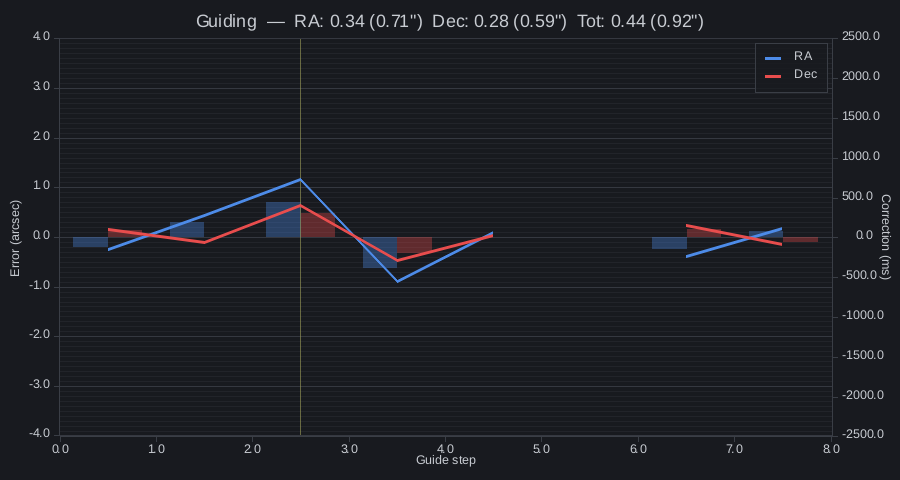
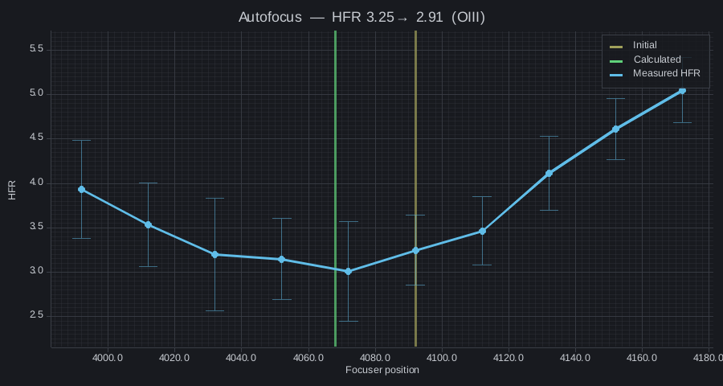

# Chatstronomy for N.I.N.A.


Bridge NINA with Discord and Matrix, supporting bot slash commands for control.

Chatstronomy exposes N.I.N.A. observatory status, images, graphs, and approved
commands to chat. It supports an easy on-machine setup as well as one central
Chatstronomy hub serving N.I.N.A. instances on different systems.

Author: Yann Ramin

License: Apache-2.0

## Capabilities

- Reads status, sequence, equipment, image, guider, and autofocus data directly
  from N.I.N.A.; the Advanced API plugin is optional rather than required.
- Supervises an on-machine Chatstronomy runtime for Discord webhooks, a
  user-owned Discord application with slash commands, Matrix over an HTTPS
  homeserver, or simultaneous Discord and Matrix delivery.
- Connects outbound to `https://hub.chatstronomy.com/` so one hosted bot can
  serve multiple N.I.N.A. installations on different computers without inbound
  observatory ports or chat credentials on each rig.
- Retains Advanced API polling as a compatibility source for existing
  Chatstronomy installations.
- Renders guider and autofocus graphs with the same native renderer in local
  and hosted modes and exposes only an allowlisted set of control commands.

## Operating modes

Source and chat delivery are independent choices:

| N.I.N.A. data source | Local chat delivery | Remote chat delivery |
|---|---|---|
| Native Direct integration | Bundled runtime with a Discord webhook, user-owned Discord app, Matrix account, or Discord plus Matrix | Outbound authenticated WSS connection to `https://hub.chatstronomy.com/` |
| Advanced API polling | Bundled runtime polls the separately installed Advanced API plugin and owns local chat credentials | Advanced API can continue through a separately managed Chatstronomy relay |

Local Direct mode starts the bundled runtime with N.I.N.A. and sends data over a
current-user-only named pipe. Remote Direct mode does not open an inbound port;
each plugin connects outbound to the hub and is identified by an installation
ID plus the active N.I.N.A. profile ID.

Local Discord/Matrix secrets and hosted credentials are stored with Windows
Credential Manager. Matrix homeserver URLs must use HTTPS. Remote control uses a
closed typed-command allowlist and rejects expired commands.

Guider and autofocus payloads use the shared Rust chart renderer in both local
and hosted modes:





## Install from N.I.N.A.

The plugin targets N.I.N.A. 3.2 or newer on Windows x64. N.I.N.A. can search
multiple plugin repositories, so the official and development channels use the
same plugin-manager flow.

### Official channel

When the signed listing is published in N.I.N.A.'s built-in repository, open
**Plugins** > **Available**, search for **Chatstronomy**, choose **Install**, and
restart N.I.N.A. No additional repository URL is needed.

### GitHub development channel

1. Open **Options** > **General** > **Plugin Repositories** and select **+**.
2. Add this repository URL (N.I.N.A. appends `/plugins/manifests` itself):

   ```text
   https://raw.githubusercontent.com/theatrus/chatstronomy-nina-plugin/main/registry
   ```

3. Open **Plugins** > **Available**, select **Chatstronomy**, choose **Install**,
   and restart N.I.N.A.

The development channel currently contains the immutable, backend-signed Rust
runtime and an unsigned test `Chatstronomy.dll`. Official tagged packages use
the release workflow documented below to sign and verify both shipped Windows
binaries before the N.I.N.A. checksum is generated.

## Recommended setup: Chatstronomy Hub

The Hub is the simplest operating path and lets one centralized bot serve N.I.N.A.
instances on different computers:

1. Open [hub.chatstronomy.com](https://hub.chatstronomy.com/) and create a
   one-time pairing code for the observatory.
2. In **Plugins** > **Installed** > **Chatstronomy**, choose
   **Chatstronomy.com — hosted bot**.
3. Keep the default Hub URL, paste the one-time code, and choose
   **Pair / reconnect**.

The plugin stores the resulting connection credential in Windows Credential
Manager and reconnects outbound over authenticated WSS. No Discord token,
Matrix password, Advanced API endpoint, or inbound observatory port is needed
on the N.I.N.A. computer. Local Discord webhook, user-owned Discord bot, Matrix,
and Advanced API modes remain available for self-hosted operation.

### Manual/source fallback

For plugin development, the latest successful
[`main` CI workflow](https://github.com/theatrus/chatstronomy-nina-plugin/actions/workflows/ci.yml?query=branch%3Amain)
also publishes `chatstronomy-nina-package-smoke-test`. After extracting the
inner plugin ZIP, a manual install uses:

```powershell
$destination = Join-Path $env:LOCALAPPDATA 'NINA\Plugins\3.0.0\Chatstronomy'
New-Item -ItemType Directory -Path $destination -Force | Out-Null
Expand-Archive `
  -LiteralPath .\Chatstronomy.NINA.0.1.0.10.zip `
  -DestinationPath $destination `
  -Force
```

To build the same package from source instead of downloading the CI artifact:

```powershell
git clone https://github.com/theatrus/chatstronomy-nina-plugin.git
cd chatstronomy-nina-plugin
./fetch-runtime.ps1
./build-package.ps1 -Version 0.1.0.10
```

The resulting ZIP is under `artifacts/nina-plugin/`. `fetch-runtime.ps1`
downloads the exact backend release pinned by `runtime.lock.json` and rejects
identity, protocol, size, or checksum mismatches.

## Repository boundary

This repository owns the C# plugin, N.I.N.A. options UI, Direct/hub client,
tests, ZIP packaging, and N.I.N.A. registry manifest. The
[`theatrus/chatstronomy`](https://github.com/theatrus/chatstronomy) backend owns
the Rust hub, bots, chart rendering, local runtime, wire schemas, and fixtures.

`runtime.lock.json` pins one immutable backend release and runtime-manifest
checksum. `fetch-runtime.ps1` verifies the manifest, protocol versions, asset
names, sizes, and SHA-256 hashes before placing the lean runtime in
`runtime-cache/`. Release builds never resolve `latest`, build from backend
`main`, or invoke Cargo.

Rust is compiled and Authenticode-signed only by the backend release. This
repository copies that signed lean executable without modifying it. Its release
workflow verifies the runtime is signed by StackFoundry LLC, stages the package,
signs `Chatstronomy.dll`, verifies both signatures, and only then creates the ZIP
and N.I.N.A. checksum. `build-package.ps1 -StageOnly` and `-PackageOnly` expose
that signing seam without changing the normal one-command development build.

The lock currently resolves backend release `v0.3.0` by the SHA-256 of its
runtime manifest. Updating the backend tag requires an explicit review and lock
change; the fetcher intentionally refuses pending or incomplete locks.

## Build and test

The plugin targets N.I.N.A. 3.2 (`NINA.Plugin` 3.2.0.9001), .NET 8, Windows x64.

```powershell
dotnet build Chatstronomy.NINA/Chatstronomy.NINA.csproj
dotnet run --project Chatstronomy.NINA.Tests/Chatstronomy.NINA.Tests.csproj --configuration Release
```

Process-level runtime and hub tests run when these variables point to verified
backend artifacts:

```powershell
$env:CHATSTRONOMY_RUNTIME_EXE = "$PWD/runtime-cache/chatstronomy.exe"
$env:CHATSTRONOMY_HUB_EXE = "$PWD/runtime-cache/chatstronomy-hub-probe.exe"
dotnet run --project Chatstronomy.NINA.Tests/Chatstronomy.NINA.Tests.csproj --configuration Release
```

The harness exercises Direct identity and pairing, source parity, typed
commands, hosted reconnect behavior, and PNG rendering for guider and autofocus
graphs.

## Package

After the runtime lock is complete:

```powershell
./fetch-runtime.ps1
./build-package.ps1 -Version 0.1.0.10
```

The ZIP has the N.I.N.A. `ARCHIVE` layout:

```text
Chatstronomy.dll
runtime/
  chatstronomy.exe
```

For a development build, `-RuntimePath` may point to a locally validated lean
runtime. There is no implicit Cargo fallback.

## Distribution

Dedicated plugin tags use four numeric parts, for example `v0.1.0.10`. The
release workflow downloads only the locked, backend-signed artifacts, runs the
full C# and cross-process compatibility suite, signs the plugin DLL, builds the
checksummed plugin ZIP, and publishes its N.I.N.A. manifest. Official N.I.N.A.
distribution can then point to that immutable GitHub release asset without
requiring a special archive name or repository layout.

The GitHub `release` environment must expose the Azure and Trusted Signing
variables consumed by `.github/workflows/release.yml`. Its Azure app registration
uses issuer `https://token.actions.githubusercontent.com`, audience
`api://AzureADTokenExchange`, and this exact federated subject:

```text
repo:theatrus@23114/chatstronomy-nina-plugin@1335518579:environment:release
```

GitHub includes immutable owner and repository IDs in that subject, so the
older name-only form does not match. A manual workflow dispatch is a non-
publishing signing dry run; use it after changing federation or signing
settings and require the runtime and plugin DLL signature-verification steps to
pass before creating a tag.
